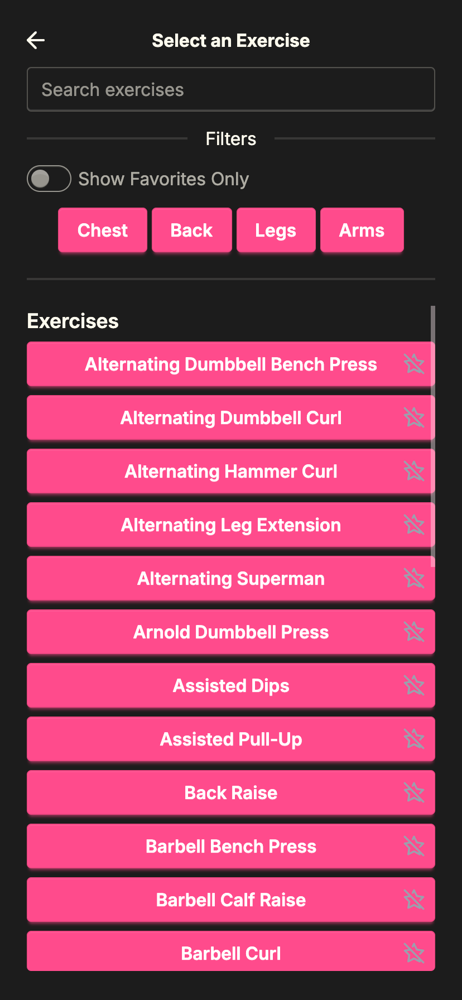
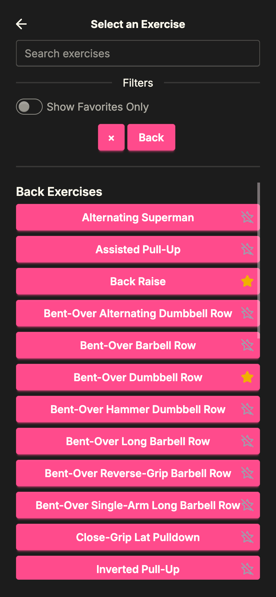
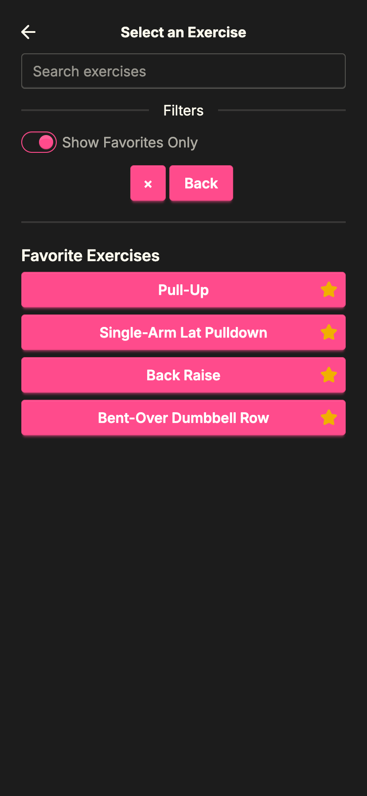
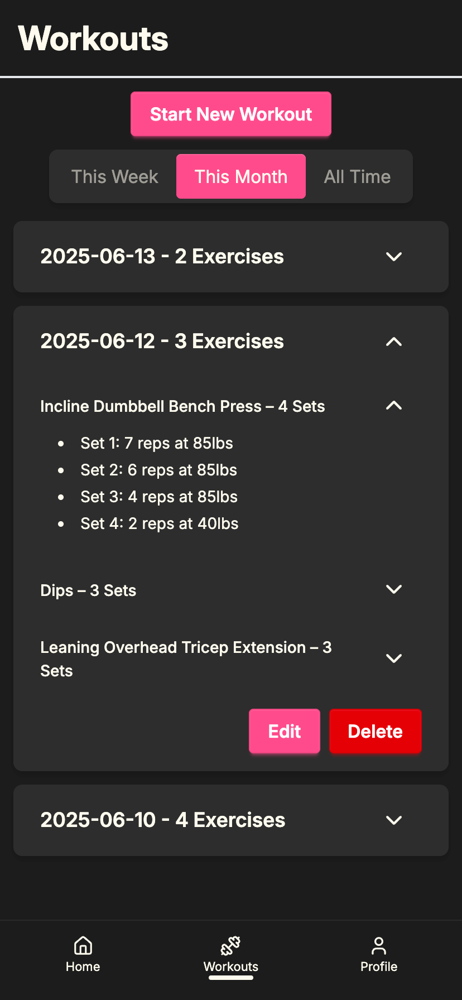
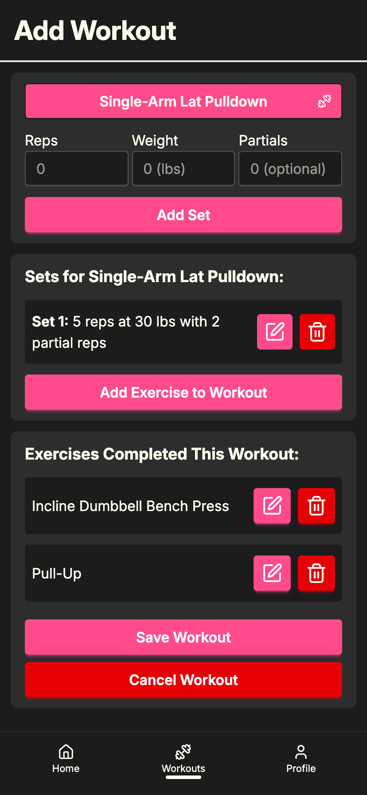

# Rive Lift Tracker 🏋️‍♂️ - Web Version

A progressive web app that allows users to track their workouts and their reps, sets, weight, and exercises.

## 🔥 Features
- 🔎 Search and filter exercises
- ⭐ Add exercises to favorites list
- ✅ View, Add, Edit, and Delete sets per exercise
- ✅ View, Add, Edit, and Delete exercises within a workout
- ✅ View, Add, Edit, and Delete previous workouts
- 🔐 Supabase Auth for login
- 💻 Supabase backend for exercises and workout history

## 🚀 Tech Stack
[Next.js](https://nextjs.org)
[Supabase](https://supabase.com)
[TailwindCSS](https://tailwindcss.com)
[DaisyUI](https://daisyui.com)
[TypeScript](https://www.typescriptlang.org/)

## 📸 Demo Screenshots

### Exercise Selector

### Exercise Selector With Filter

### Exercise Selector With Favorites Only

### Workout History Screen

### Add Workout Screen

## 🧠 What I learned
- Using Supabase and Row-Level Security (RLS)
- How to build reusable components in React
- How to create clean user interfaces

## ✨ Future Ideas and Enhancements
- Customizable workout templates
- Personal records and analytics tracking
- Bigger exercise selection list
- Ability to specify unilateral movements
- Sign In/ Sign Up with Google and Apple

