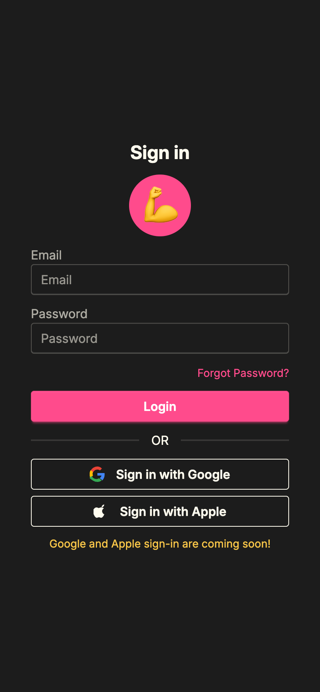

# Rive - Lift Tracker 🏋️‍♂️

A modern Progressive Web App (PWA) for tracking workouts, exercises, and personal fitness progress. Built with Next.js 15, Supabase, and TypeScript.

## 🌐 Live Demo

[Rive Lift Tracker](https://project-hyper.vercel.app/)

## ✨ Key Features

### 🏠 **Workout Management**

- Create and manage custom workout templates
- Add exercises to workouts
- View workout history and progress
- Edit and delete existing workouts

### 🎯 **Exercise Tracking**

- Comprehensive exercise database with categories
- Search and filter exercises by name or category
- Track sets, reps, weight, and partial reps
- Copy previous set data for efficiency

### 📱 **Session Management**

- Start new workout sessions
- Real-time exercise tracking with set management
- Weight increment controls (2.5lb, 5lb, 10lb)
- Complete workout sessions with full history

### 👤 **User Experience**

- Clean, modern UI with DaisyUI components
- Responsive design optimized for mobile
- Bottom navigation for easy app navigation
- Toast notifications for user feedback
- PWA support for app-like experience

### 🔐 **Authentication & Security**

- Supabase authentication system
- Row-Level Security (RLS) for data protection
- User profile management
- Secure data storage and retrieval

## 🛠️ Tech Stack

### **Frontend**

- [Next.js 15](https://nextjs.org) - React framework with App Router
- [React 19](https://react.dev) - Latest React with concurrent features
- [TypeScript](https://www.typescriptlang.org/) - Type-safe development
- [Tailwind CSS 4](https://tailwindcss.com) - Utility-first CSS framework
- [DaisyUI](https://daisyui.com) - Component library for Tailwind
- [Lucide React](https://lucide.dev) - Beautiful icons
- [Sonner](https://sonner.emilkowal.ski) - Toast notifications

### **Backend & Database**

- [Supabase](https://supabase.com) - Backend-as-a-Service
  - PostgreSQL database
  - Real-time subscriptions
  - Row-Level Security (RLS)
  - Authentication system

### **Development & Deployment**

- [Turbopack](https://turbo.build/pack) - Fast bundler
- [ESLint](https://eslint.org) - Code linting
- [Vercel](https://vercel.com) - Deployment platform
- [Serwist](https://serwist.pages.dev) - Service Worker for PWA

## 📱 PWA Features

- **Installable** - Add to home screen on mobile devices
- **Offline Support** - Service worker for offline functionality
- **App-like Experience** - Standalone mode with custom icons
- **Responsive Design** - Optimized for all screen sizes

## 🏗️ Project Structure

```
src/
├── app/
│   ├── components/          # Reusable UI components
│   │   ├── authguard.tsx   # Authentication wrapper
│   │   ├── bottomnav.tsx   # Bottom navigation
│   │   ├── sessions/       # Session-related components
│   │   └── workouts/       # Workout-related components
│   ├── context/            # React context providers
│   │   ├── authcontext.tsx # Authentication state
│   │   └── modalcontext.tsx # Modal management
│   ├── lib/               # Utility functions
│   │   ├── supabaseClient.ts # Supabase configuration
│   │   └── utils.ts       # Helper functions
│   ├── login/             # Authentication pages
│   ├── profile/           # User profile pages
│   ├── sessions/          # Workout session pages
│   └── workouts/          # Workout management pages
├── types/                 # TypeScript type definitions
│   └── workout.ts         # Workout-related types
└── globals.css           # Global styles
```

## 🚀 Getting Started

### Prerequisites

- Node.js 18+
- npm or yarn

### Installation

1. **Clone the repository**

   ```bash
   git clone https://github.com/yourusername/rive-lift-tracker-web.git
   cd rive-lift-tracker-web/project-hyper
   ```

2. **Install dependencies**

   ```bash
   npm install
   ```

3. **Set up environment variables**
   Create a `.env.local` file with your Supabase credentials:

   ```env
   NEXT_PUBLIC_SUPABASE_URL=your_supabase_url
   NEXT_PUBLIC_SUPABASE_ANON_KEY=your_supabase_anon_key
   ```

4. **Run the development server**

   ```bash
   npm run dev
   ```

5. **Open your browser**
   Navigate to [http://localhost:3000](http://localhost:3000)

## 📸 Screenshots

<details>
  <summary>📸 Click to View Screenshots</summary>
  
### Login Screen


### Exercise Selector


### Exercise Selector With Filter


### Exercise Selector With Favorites Only


### Workout History Screen


### Add Workout Screen


</details>

## 🧠 What I Learned

- **Modern React Patterns**: Using React 19 with concurrent features and the new App Router
- **Supabase Integration**: Implementing authentication, RLS policies, and real-time data
- **PWA Development**: Creating installable web apps with service workers
- **TypeScript Best Practices**: Type-safe development with proper interfaces
- **Component Architecture**: Building reusable, composable components
- **State Management**: Using React Context for global state
- **Mobile-First Design**: Responsive design with touch-friendly interfaces

## 🔮 Future Enhancements

- [ ] **Analytics Dashboard** - Personal records and progress tracking
- [ ] **Social Features** - Share workouts and compete with friends
- [ ] **Advanced Exercise Library** - More exercises with video demonstrations
- [ ] **Workout Templates** - Pre-built workout routines
- [ ] **Nutrition Tracking** - Calorie and macro tracking
- [ ] **Wearable Integration** - Apple Watch and Fitbit sync
- [ ] **Export Data** - CSV/PDF workout reports
- [ ] **Dark/Light Theme** - User preference settings

## 🙏 Acknowledgments

- [Supabase](https://supabase.com) for the amazing backend platform
- [Vercel](https://vercel.com) for seamless deployment
- [DaisyUI](https://daisyui.com) for the beautiful component library
- [Lucide](https://lucide.dev) for the beautiful icons
